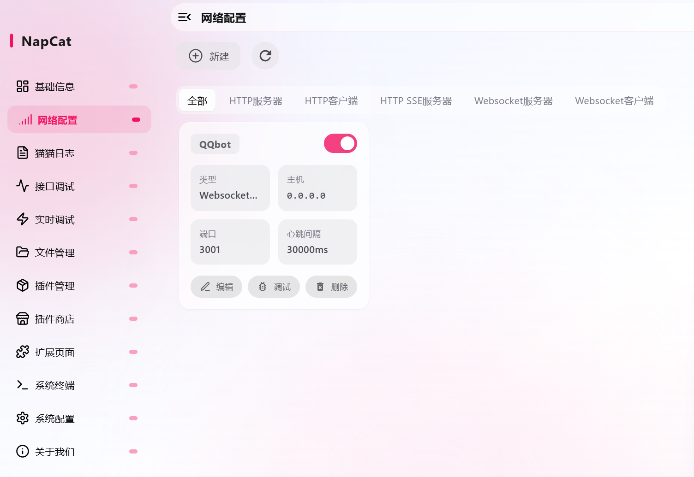
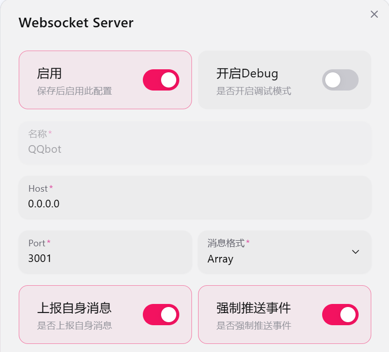

# 使用方法

1. 自行使用napcat的安装脚本安装好napcat登录好然后服务中添加ws服务器 注意webui ws设置强密码（不然机器人会报错）
2. 完成所有的.example文件

- .env
- config.yaml (只用完成 root_qqid bot_qqid ws_token ws_url 酌情改)
- ./workflows/agent_config.yaml

1. 在当前目录运行“docker compose pull”下载image
2. 运行“docker compose up -d”构建容器
3. “docker start qqbot”启动容器
4. 理论上万事大吉

## napcat docker 安装配置方法

```(sh)
    docker run -d \
    -e NAPCAT_GID=$(id -g) \
    -e NAPCAT_UID=$(id -u) \
    -p 3000:3000 \
    -p 3001:3001 \
    -p 6099:6099 \
    --name napcat \
    --restart=always \
    mlikiowa/napcat-docker:latest
```

然后 `docker logs napcat 2>&1 | grep "token"` 连接登录

然后如下配置napcat


